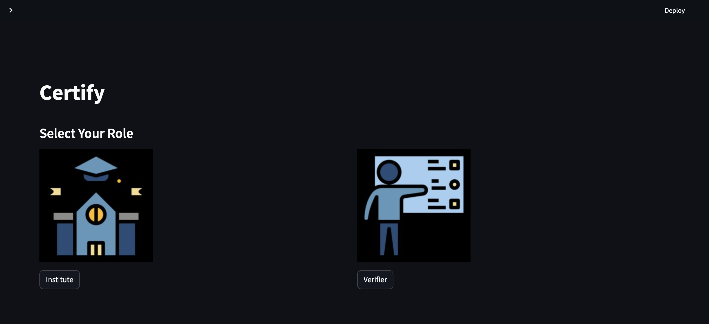
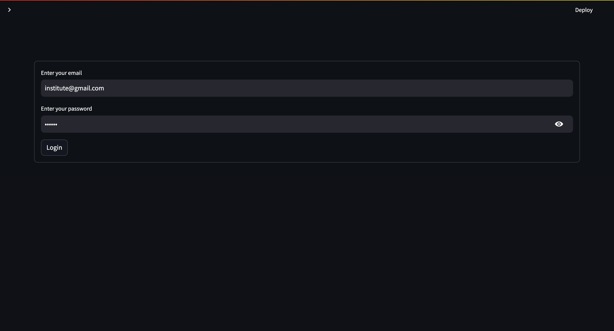

# FITE2010 Group Project：
Blockchain Certificate Entry and Verification Platform

# Group members:
  - Gong Yiqi 3036056861
  - Yan Xiaohan 3035770604
  - Lin Yuxi 3035973361
  - Zhou Xuekai 3035973763
  - Qian Yifei 3035973880
  - Ma Junchi 3036094722

# Project Overview
The Blockchain Certificate Entry and Verification Platform is an application based on blockchain technology and smart contracts. Its purpose is to simplify the process of certificate generation and verification while ensuring the integrity and authenticity of the certificates. By leveraging the immutability and decentralization features of blockchain, the platform provides a secure and reliable solution for certificate management and verification.

# Key Features and Highlights
- **Certificate Entry**: The platform allows users to enter certificate information, including a unique identifier (UID), candidate's name, course name, issuing authority, and more. This information is stored on the blockchain, ensuring data immutability and transparency.

- **Certificate Generation**: The platform integrates with the Pinata service to generate a PDF file from the entered certificate information. The generated file is stored on IPFS (InterPlanetary File System), enabling decentralized file storage and distribution.

- **Certificate Verification**: Users can utilize the platform's verification feature by inputting the certificate's unique identifier or uploading the PDF file. The verification process queries the certificate information stored on the blockchain and compares it with the uploaded file, ensuring the certificate hasn't been tampered with.

- **Smart Contracts**: The platform utilizes the Solidity language to write smart contracts deployed on the Ethereum blockchain. Smart contracts manage and store detailed certificate information, provide verification functionality, and ensure data security and reliability.

- **Identity Authentication**: The platform employs Firebase Authentication service to ensure that only authenticated users can enter and verify certificates, providing secure and controlled access.

- **User Interface**: The platform offers an intuitive user interface built using the Streamlit application framework. Users can easily perform certificate entry, generation, and verification operations without needing in-depth knowledge of blockchain and smart contract technology.

# Prerequisites
- Globally installed packages for Truffle and Ganache-cli:
  ```shell
  npm install -g truffle
  npm install -g ganache-cli
  ```
- Python packages:
  In the project's root directory, execute the following command:

  ```shell
  pip install -r application/requirements.txt
  ```

  It is recommended to create a virtual environment and then install the requirements and run the Streamlit application in that virtual environment.

- Firebase project setup:
  1. Create a project on the Firebase Console. This project will be used to set up an authentication service in the project.
  2. Enable the email/password sign-in method under Authentication in the Build section.
  3. Go to project settings and add a new app. Note the following details in a `.env` file inside the project's root directory:

     ```
     FIREBASE_API_KEY=<Your Firebase API key>
     FIREBASE_AUTH_DOMAIN=<Your Firebase auth domain>
     FIREBASE_DATABASE_URL=
     FIREBASE_PROJECT_ID=<Your Firebase project id>
     FIREBASE_STORAGE_BUCKET=<Your Firebase Storage Bucket>
     FIREBASE_MESSAGING_SENDER_ID=<Your Firebase messaging sender id>
     FIREBASE_APP_ID=<Your Firebase app id>
     ```

- Pinata account setup:
  1. Create an account on Pinata.
  2. Go to the API keys section and generate a new key.
  3. Note the API key and secret key in the `.env` file:

     ```
     PINATA_API_KEY=<Your Pinata API key>
     PINATA_API_SECRET=<Your Pinata Secret Key>
     ```

- Additional `.env` file entries:

  Finally, your `.env` file should contain the following entries:

  ```
  institute_email="institute@gmail.com" # Feel free to modify this
  institute_password="123456" # Feel free to modify this
  ```

  Note: The institute email and password in the `.env` file will be used to log in as the institute inside the app.

# Installation and Deployment
## Method 1: Manual Installation and Deployment
**Prerequisites:**
- Make sure you have the following tools and dependencies installed:
  - Ganache CLI (for launching a local blockchain node)
  - Truffle (for compiling and deploying smart contracts)
  - Streamlit (for running the application)
**Steps:**
1. Open a terminal anywhere and start the Ganache blockchain:
   ```shell
   ganache-cli -h 127.0.0.1 -p 8545
   ```
2. Open a new terminal in the project's root directory and execute the following command to compile and deploy the smart contracts:
   ```shell
   truffle migrate
   ```
3. Change the working directory to the application directory inside the project's root directory:
   ```shell
   cd application
   ```
4. Launch the Streamlit app:
   ```shell
   streamlit run app.py
   ```
5. You can now view the app in your browser running on `localhost:8501`.

   **Note:** To stop the application, press `Ctrl+C` in the terminal.

## Method 2: Running with Docker

**Prerequisites:**

- Make sure you have Docker Desktop installed (for Windows/Mac/Linux) or Docker package installed (for Linux).

**Steps:**

1. Open a terminal in the project's root directory.

2. Run the following command to start two containers (ganache and Streamlit app):

   ```shell
   docker-compose up
   ```

3. You can now view the app in your browser at `localhost:8501`.

   **Note:** To stop and remove the containers, use the following command:

   ```shell
   docker-compose down
   ```

Please note that you'll need your institution email (e.g., "XXX@gmail.com") and password (e.g., "XXX") to log in as a verifier for the certificate generation process.

# Dependencies and System Requirements

Please make sure you have the following dependencies and system requirements met:

**Dependencies:**
- Ganache CLI (for launching a local blockchain node)
- Truffle (for compiling and deploying smart contracts)
- Streamlit (for running the application)

**System Requirements:**
- Operating System: Windows/Mac/Linux
- Node.js version >= 21.0.0
- Python version >= 3.9.10
- Docker Desktop (for running with Docker, if using Method 2)


# Certification Smart Contract

Following are the contents of "Certification.sol", a Solidity contract that allows the generation, retrieval, and verification of certificates. It utilizes a mapping to store certificate details and provides functions to interact with the contract.

## Functions

### generateCertificate

```solidity
function generateCertificate(
    string memory _certificate_id,
    string memory _uid,
    string memory _candidate_name,
    string memory _course_name,
    string memory _org_name,
    string memory _ipfs_hash
) public
```

This function generates a new certificate with the provided details. It takes the following parameters:

- `_certificate_id`: The unique ID for the certificate.
- `_uid`: The UID associated with the certificate.
- `_candidate_name`: The name of the candidate who received the certificate.
- `_course_name`: The name of the course for which the certificate is issued.
- `_org_name`: The name of the organization issuing the certificate.
- `_ipfs_hash`: The IPFS hash of the certificate document.

### getCertificate

```solidity
function getCertificate(string memory _certificate_id)
    public
    view
    returns (
        string memory _uid,
        string memory _candidate_name,
        string memory _course_name,
        string memory _org_name,
        string memory _ipfs_hash
    )
```

This function retrieves the details of a certificate based on its ID. It takes the certificate ID as a parameter and returns the following values:

- `_uid`: The UID associated with the certificate.
- `_candidate_name`: The name of the candidate who received the certificate.
- `_course_name`: The name of the course for which the certificate is issued.
- `_org_name`: The name of the organization issuing the certificate.
- `_ipfs_hash`: The IPFS hash of the certificate document.

### isVerified

```solidity
function isVerified(string memory _certificate_id) public view returns (bool)
```

This function checks if a certificate with the given ID exists and is verified. It takes the certificate ID as a parameter and returns a boolean value indicating whether the certificate is verified (i.e., its IPFS hash is not empty).

## Example Usage

Here are some examples of how to interact with the Certification smart contract:

1. Generate a certificate:

```solidity
Certification certContract = new Certification();
certContract.generateCertificate(
    "CERT-001",
    "123456789",
    "John Smith",
    "Blockchain 101",
    "Blockchain Institute",
    "QmX5d2asdjh2d3sdfj2d3..."
);
```

2. Get the details of a certificate:

```solidity
Certification certContract = Certification(contractAddress);
(
    string memory uid,
    string memory candidateName,
    string memory courseName,
    string memory orgName,
    string memory ipfsHash
) = certContract.getCertificate("CERT-001");
// Use the retrieved values as needed
```

3. Check if a certificate is verified:

```solidity
Certification certContract = Certification(contractAddress);
bool isVerified = certContract.isVerified("CERT-001");
// Use the value of `isVerified` for further processing or validation
```

These examples demonstrate how to interact with the Certification smart contract to generate certificates, retrieve their details, and check their verification status.

# Application Screenshots

## Homepage



*This is a screenshot of the homepage, showcasing the interface of the website or application's main landing page.*

## Login Page



*This is a screenshot of the login page, where users can enter their credentials to access the system.*

## Generate Certificate


*This image shows the interface for generating a certificate. Users can fill in the required information and click a button to generate a certificate.*

## View Certificate


*Here is a snapshot of the certificate view. Users can view and download the generated certificate in a visually appealing format.*

## Verify Using ID


*In this screenshot, you can see the process of verifying a document using an ID. Users can upload an ID document and compare it with the provided information.*

## Verify Using PDF


*This image demonstrates the verification process using a PDF document. Users can upload a PDF document and perform various verification checks.*


